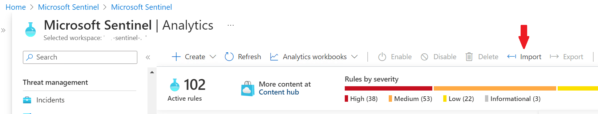

## Description

The solution allows to change network configuration of a Storage Account to prevent network traffic from an unknown IP addresses. The list of allowed addresses is stored in a dedicated watchlist.  
Based on AuditLogs, changes to a storage account are detected and in case these are related to unallowed changes of network config, an incident is created. In response to the incident, playbook is executed to enforce required settings (based on Watchlist contents).

## Deployment

### Playbook
To deploy the playbook (_azuredeploy.json_), select the following button:

### Analytics rule
Analytics rule template that can be imported is available as _analytic.json_ and can be imported from the Sentinel portal:  

 

### Watchlist
Watchlist should be created from a csv file and needs at least one column named _IPAddress_. Watchlist should be named _StorageAccountsAllowedIPs_, otherwise corresponding name should be changed in analytics rule and playbook.
   

> **Note** 
> Please note that this example is not production ready. It is just an idea of using playbooks and watchlists to change Azure resources configuration.
